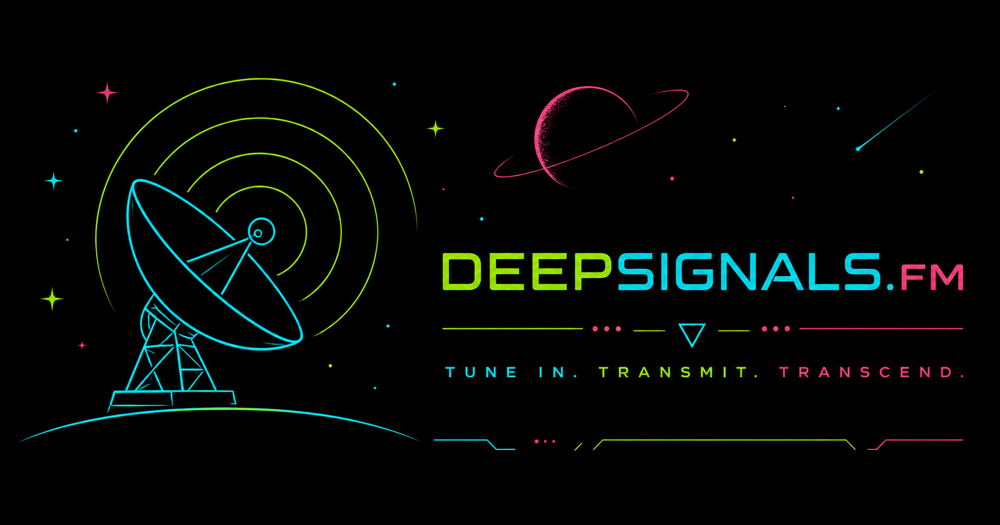

<p align="center">
	
</p>

# DeepSignals.FM

A psychedelic trance radio experience built with React, TypeScript and Three.js.

## Brand

**TUNE IN. TRANSMIT. TRANSCEND.**

| Role | Color | Hex |
| --- | --- | --- |
| DEEP / primary signal | Neon Green | `#9cff57` |
| SIGNALS / transmission | Neon Cyan | `#47f7ff` |
| .FM / broadcast accent | Neon Salmon | `#ff7fa1` |
| Primary background | Signal Black | `#020202` |

The wordmark colors come from the resolved decoder states in `src/components/publicBrandIdent.css`; Signal Black is the shared `html, body` background in `src/index.css`.

## Current Status

🚧 Early development

The current public site is a "coming soon" experience while the player is being developed.

## Planned Features

- Multiple visual environments
- Psytrance radio player
- Theme engine
- Community stations
- AI-generated visual experiences
- AI DJ experiments

Built primarily as a learning project and a love letter to psychedelic trance.

## Player Architecture

DeepSignals.FM currently features **19 registered environments** across several distinct families, each with different audio-reactivity contracts and visual semantics.

The player is designed to be extended through well-defined audio signal contracts rather than duplicating analysis pipelines in every new environment.

### Environment Inventory

**Three.js Environments (3):**
- **Signal Runner**: Audio-reactive signal flight with sustained-energy travel
- **Race to the Signal Nexus** (Neon Hyper-Racer): High-performance travel track with smooth energy-based speed
- **The Signal Nexus** (Cosmic Nexus): Standalone complex reactive scene with orbital/particle systems

**Minimal Environment (1):**
- CSS-based fallback, no audio reactivity

**2.5D Image-Depth Environments (15):**
- Production-preset environments (7): UV Reactive Jungle, Analog Signal Laboratory, Bioluminescent Psy Forest, Bioluminescent Psy Reef, Crystal Cavern, Slime Cavern, Female DJ 1
- Additional registered environments (8): Psychedelic Temple, Alien DJ 1, Dark Psy Temple, Dark Ritual Swamp, Energy Rift Swamp, Female Meditation 1, Lost Relay Tower, Psy Swamp Citadel

The public player currently exposes 10 of these via the environment dropdown.

## Player Control Semantics

The player provides four control dimensions: **PLAY/STOP**, **MOTION**, **CHROMA**, and **VOLUME**. These controls implement shared semantics across all environment families, though family-specific behavior notes are documented separately.

### PLAY / STOP

**PLAYING** state enables audio analysis and audio-driven reactivity.

**STOPPED** state:
- Audio-derived values return toward neutral (zero energy, zero frequency data, etc.)
- Audio-driven scene behavior stops
- Some environments may retain **authored** or **procedural** non-audio visuals while stopped

Do NOT assume every visual effect freezes on STOP. For example, some Three.js environments may continue procedural animation or color effects that are not audio-dependent.

### MOTION

**MOTION ON** (default) permits:
- Spatial animation: travel, parallax, camera/world movement
- Geometric animation: rotations, scale changes, object motion
- Time-based scene evolution where applicable
- SURGE geometry movement

**MOTION OFF** freezes all spatial/time-based animation specific to motion, but:
- CHROMA/color response may continue
- Procedural time-independent effects may continue
- Lighting may respond to audio if environment design allows

MOTION is **independent** from CHROMA. Disabling motion should not disable color/hue response.

### CHROMA

**CHROMA ON** (default) enables:
- Dynamic hue/palette behavior
- Shared mapped chroma hue (if environment uses it)
- Audio-driven color reactivity

**CHROMA OFF** returns colors to stable authored palette. The visual result depends on environment design but generally eliminates audio-driven color changes.

### VOLUME

The audio analysis pipeline operates as:

```
audio source → analyser → destination
```

The analyser examines audio **before** the speaker output volume control.

**Important**: Audio-analysis snapshots use the analyzer connected directly to the media source (`source → analyser → destination`), so they are **NOT automatically volume-attenuated** by the player output level. Scenes that want direct player volume control must apply it explicitly.

**Current volume behavior by environment:**
- **Signal Runner**: Travel does **not** explicitly multiply its speed by `state.volume`. The scene includes a small base/idle velocity (`travelVelocity = 2.2 + normalizedSpeed² * 86`), so it can retain slow forward/coasting movement even when musical travel energy approaches zero. In browser testing, changing player volume appears to change Signal Runner visual reactivity, but the exact analyzer-level mechanism has not been conclusively established.
- **Image-Depth scenes**: Do NOT apply volume to snapshot signals
- **Race to the Signal Nexus**: **Does** explicitly multiply travel speed by `state.volume` for direct player control; complete stop when volume = 0

**Current presentation difference**:
- **Race to the Signal Nexus** can reach a complete stop at volume zero because it explicitly scales target speed by player volume.
- **Signal Runner** retains a small idle/coasting velocity even when energy approaches zero. Both behaviors are currently acceptable; they do not need normalization unless future design/testing gives a reason to change them.

**Future implementations**: Avoid accidentally applying volume twice (once in analysis gain, once in the scene). Use current code patterns as reference.

## Environment Families

### 2.5D Image-Depth Environments

These scenes use a parallax depth-map approach with strong beat/depth relationships.

**Audio signal consumption:**
- `bass` → primary parallax depth influence (sustained low-frequency motion)
- Accepted kick / kick envelope → discrete depth-envelope responses (thumps/pulses)
- `smoothedEnergy` → sustained lighting/glow intensity
- `transient` → short accent glow/sparkle effects
- Shared CHROMA hue → palette rotation/color mapping

**Important semantic distinction**: Beat-driven depth thumping is **intentional** for this family and should NOT be treated as a mistake. Depth-map scenes benefit from perceptible kick response for visual rhythm. This is different from the anti-pumping rule for Three.js travel scenes (see below).

**Motion gating behavior:**
- MOTION OFF: Depth parallax and autonomous breathing freeze; lighting/CHROMA reactivity continues
- Reactive depth envelopes: Controlled by geometry-motion gating, not independently available while motion is off

**Authoring approach:** These scenes excel at artistic visual interpretation of depth. Strong parallax + beat thumping is a valid design pattern for this family.

### Modern Three.js Travel / Reactive Environments

**Signal Runner** and **Race to the Signal Nexus** represent the contemporary pattern for Three.js environments.

#### Core principle: Separate sustained motion from beat detail

**Sustained travel** uses `smoothedEnergy`:

```
smoothedEnergy (sustained audio envelope)
  → normalized to [0, 1]
  → mapped to target speed
  → eased to current speed
  → accumulated for world position
```

This produces smooth acceleration/deceleration, not tick-by-tick pumping.

**Beat detail** uses `kick` and `transient` for:
- Localized reactor pulses
- Short accent geometry
- Discrete visual detail, not large-scale motion

**Why not use raw kick for travel?**

Direct kick/transient usage causes undesirable:
```
fast → slow → fast → slow → fast
```
pumping, especially noticeable during kick-heavy music. Smooth energy preserves musical alignment without distraction.

**Volume in Hyper-Racer:** The one exception: `targetSpeed = volume * travelEnergy * scaleFactor`. This explicit multiplier gives the player direct volume-based control of scene energy. Do NOT replicate this in Signal Runner style scenes without an explicit design decision.

**Motion/CHROMA behavior:**
- MOTION OFF: All spatial travel and world animation freezes; procedural twinkle and CHROMA may continue
- CHROMA ON: Shared mapped hue affects environment colors while playback is active; hue resets when stopped
- SURGE: Rare qualified burst event (see below) may temporarily override normal behavior

#### Implementation pattern

New Three.js travel environments should:
1. Consume `smoothedEnergy` for travel/locomotion semantics
2. Use `kick`/`transient` for localized short-lived detail only
3. Implement shared CHROMA hue mapping rather than custom color analysis
4. Respect MOTION and CHROMA gates
5. Create artistic interpretation of signals, not duplicate analysis

### The Signal Nexus

Standalone older implementation with richer local reactive mappings:
- Mapped from `smoothedEnergy`, `bass`, `mids`, `highs`, `kick` into multiple reactive dimensions
- Orbital/particle/lane reactivity with independent intensity states
- Local smoothing envelopes per dimension

This environment does not yet represent the finalized modern Three.js pattern. It can later be deliberately migrated to use shared signals.

**Current status**: Functional; do not use as template for new environments. Reference Signal Runner / Hyper-Racer instead.

### Minimal Environment

- CSS-based fallback with no Three.js
- No audio reactivity
- MOTION and CHROMA controls not exposed in UI
- Intended as lightweight static backdrop

---

## Audio Reactivity Signal Reference

The audio-analysis pipeline produces these signals available to environments via `AudioReactiveSnapshot`:

### `smoothedEnergy`

**Represents:** Sustained musical energy across the audio spectrum.

**Temporal behavior:** Attack ≈0.2/sec, Release ≈0.04/sec (exponential envelope).

**Good for:**
- Travel speed / locomotion semantics
- Large-scale scene intensity
- Sustained visual state
- CHROMA hue mapping target
- Overall energy/presence

**Avoid for:**
- Short-lived visual detail
- Beat-by-beat thumping (use `kickPulse` instead)

### `kickPulse`

**Represents:** Low-frequency beat response (kick drum, bass transients).

**Temporal behavior:** Attack ≈0.78/sec, Release ≈0.16/sec; cooldown 205ms between detected events.

**Good for:**
- Depth thumps (image-depth scenes)
- Localized reactor/core pulses
- Discrete beat details
- Short accent lighting

**Avoid for:**
- Primary vehicle speed (causes pumping)
- Sustained motion

### `transient`

**Represents:** Broadband onset energy (sudden spectral change of any frequency).

**Temporal behavior:** Fast attack ≈0.48/sec, moderate release ≈0.16/sec, cooldown 95ms.

**Good for:**
- Sparkle/accent effects
- Short hi-hat response
- Localized flashes
- Transient detail

### `bass`, `mids`, `highs`

Frequency-band-separated energy:
- `bass`: 30–220 Hz (kick, sub-bass)
- `mids`: 180–2000 Hz (vocals, snare, mid-range synths)
- `highs`: 2–10 kHz (cymbals, presence, sparkle)

**Use case:** Component-specific reactivity where appropriate (e.g., bass for depth, highs for particles). Do not over-prescribe globally.

### `kickPulseAcceptedEvent` / `kickPulseAcceptedEventCount` / `kickPulseAcceptedEventSequence`

Discrete accepted beat event detection.

**Important clarification:**
```
acceptedKickEvent ≠ SURGE / BLAST OFF
```

Multiple accepted kicks occur continuously without triggering a SURGE. The kick event provides the raw beat information; SURGE is a separate qualified state machine.

---

## CHROMA / Hue Mapping Semantics

Environments that support CHROMA (all except Minimal) use a shared hue mapping:

```typescript
targetHue = mapSignalToHueDegrees(smoothedEnergy)

currentHue += (targetHue - currentHue) * temporalSmoothingResponse
```

**Key pattern:**

Do NOT use:
```typescript
lerp(0, targetHue, response)
```

That scales/compresses the target. Instead, temporally smooth **toward** the target, preserving its magnitude.

**Visual implementation:**

Authored material colors should be **rotated** by the shared hue offset rather than replacing every object with one absolute color. This preserves authored palette relationships while enabling dynamic hue response.

---

## Shared SURGE / BLAST OFF Semantics

A shared qualification algorithm in `sharedSurgeQualification.ts` provides a qualified high-energy event.

### Current Architecture

**Signal Runner** and **Race to the Signal Nexus** maintain **separate per-environment qualification state machines** using the same shared algorithm.

They do **NOT** share a centralized event instance; they use the same thresholds/semantics independently.

### Qualification Semantics

**State machine behavior:**
1. **Arm** when `smoothedEnergy` ≤ 68% for ≥400ms
2. **Trigger** when energy rises above 99% while armed
3. **Cooldown** for 1500ms before next possible trigger
4. **Reset** when playback stops or MOTION is disabled

**Sequence participation:** `kickPulseAcceptedEventSequence` participates in event semantics for tighter rhythm coupling.

### Important distinction

```
accepted kick event (continuous)
≠
SURGE / BLAST OFF (rare qualified burst)
```

Multiple kicks occur without triggering SURGE. SURGE is the qualified state transition, not every beat.

### Visual interpretation

Each environment decides how to visualize the same semantic event:
- **Signal Runner** → BLAST OFF display overlay
- **Race to the Signal Nexus** → Nexus/starfield overload with surge waves and bolts

This separation of **shared semantics** (when the event occurs) from **family-specific visualization** (how it looks) is the key pattern.

---

## Building Environments

### Building a New Three.js Reactive Environment

New travel-style or complex Three.js environments should consume shared semantic signals rather than reimplementing audio analysis.

**Input signals available:**

```
playback state (isPlaying)
motion enabled (motionEnabled)
chroma enabled (chromaEnabled)
smoothedEnergy
shared mapped chroma hue (calculated externally)
shared SURGE qualification (via helper)
optional localized detail:
  kickPulse
  transient
  bass / mids / highs
```

**Design pattern:**

1. **Sustained motion/state:** Use `smoothedEnergy` for travel speed, world intensity, large-scale evolution
2. **Beat detail:** Use `kick`/`transient` for localized fast effects, not primary motion
3. **Color:** Consume shared chroma hue for palette rotation; apply it to materials via offset rather than absolute replacement
4. **Motion gating:** Respect `motionEnabled`; freeze spatial animation but allow CHROMA/procedural effects
5. **SURGE:** Call `updateSharedSurgeQualification()` to detect rare burst events; decide how to visualize them
6. **Authorship:** Create artistic interpretation, not a duplicate audio-analysis pipeline

**Why reuse signals?**

- Consistency across environments
- Reduced complexity
- Easier to tune global audio response
- Future agents understand established patterns

**Code reference:** Signal Runner (`src/experiments/signal-runner/SignalRunnerScene.tsx`) and Race to the Signal Nexus (`src/themes/neon-hyper-racer/NeonHyperRacerTheme.tsx`) are the primary examples.

### Building a New 2.5D Image-Depth Environment

The existing workflow below is proven and should be used for all new image-depth scenes.

**Key reactivity notes specific to this family:**

- **Bass → Depth**: Bass-band energy directly influences parallax depth displacement (sustained low-frequency motion)
- **Kick → Depth envelope**: Accepted kick events trigger discrete depth-thumping envelopes (fast attack, slower release)
- **Energy → Lighting**: Sustained `smoothedEnergy` drives glow, saturation, and brightness pulses
- **Transient → Accent**: Short broadband transients add accent glow (hi-hat sparkle effect)
- **CHROMA**: Shared hue mapping applies to palette rotation; enable/disable via CHROMA toggle

**Design philosophy:**

Beat-driven depth thumping is intentional and appropriate for this family. Do NOT try to replace all depth motion with smooth travel energy; that rule applies to Three.js travel scenes, not depth-map artistic displacement.

Strong visual rhythm from kick response is a valid design goal for image-depth themes.

## Image Environment Workflow

DeepSignals.FM uses a source-controlled workflow for image/depth environments.

Proven workflow:

1. Generate or create source artwork.
2. Upscale to the desired master resolution.
3. Generate a matching depth map.
4. Optimize the production color asset.
5. Create `public/environments/<id>/`.
6. Add `<id>-color.webp`.
7. Add `<id>-depth.png`.
8. Register the environment in `src/themes/image-depth/environmentCatalog.ts`.
9. Run `npm run validate:environments`.
10. Define or tune behavior in `src/themes/image-depth/productionScenePresets.ts` (or use overrides in the catalog registration seed).
11. Visually verify in `/player`.
12. Optionally verify runtime behavior in `/player` while running locally in DEV.
13. Validate and commit.

Detailed guide: `docs/creating-image-environments.md`

### Removing an image environment

Use this manual cleanup workflow:

1. Remove the environment seed from `src/themes/image-depth/environmentCatalog.ts`.
2. Remove its production preset from `src/themes/image-depth/productionScenePresets.ts`.
3. Remove any now-unused preset imports.
4. Delete its color and depth assets under `public/environments/<environment-id>/`.
5. Delete environment-specific wrapper files under `src/themes/<environment-id>/` only if such files actually exist.
6. Search the repository for the environment id, display name, and preset symbol to confirm no stale references remain.
7. Run `npm run build`, `npm run lint`, and `npm run validate:environments`.

The environment validator derives its total count from the catalog automatically, so a hard-coded environment count usually does not need updating.

## Player State & Behavior Matrix

### Shared Semantics

The player controls define a shared semantic contract across all environments:

| State | Intended Meaning |
| --- | --- |
| **PLAYING** | Audio analysis and audio-driven reactivity available |
| **STOPPED** | Audio-derived values return toward neutral; audio-driven behavior pauses |
| **MOTION ON** | Spatial/time-based scene animation permitted |
| **MOTION OFF** | Spatial scene animation frozen; other effects may continue |
| **CHROMA ON** | Dynamic color/hue/palette behavior permitted |
| **CHROMA OFF** | Stable authored palette; audio-driven color changes suppressed |
| **SURGE** | Rare qualified high-energy event occurs (both environments) |

### Family-Specific State Behavior Notes

#### 2.5D Image-Depth Scenes

**MOTION OFF:**
- Depth parallax geometry freezes
- Autonomous depth breathing stops
- Lighting/CHROMA reactivity continues unaffected
- Result: Static depth with active color response

**STOPPED:**
- Grayscale filter animates in
- Audio-driven lighting stops
- Non-audio color effects may persist depending on implementation

#### Signal Runner

**MOTION OFF:**
- Travel and spatial movement freeze
- Star spatial movement stops completely
- Current CSS HUD remains independent (will be removed/refactored in future)

**STOPPED:**
- Travel speed becomes zero
- Audio signals drop to zero baseline
- Visual elements render at reduced opacity

#### Race to the Signal Nexus

**MOTION OFF:**
- Track travel freezes
- Nexus spatial rotation/scale animation stops
- SURGE-driven geometry movement suppressed
- Star procedural twinkle continues (gated by CHROMA, not MOTION)
- Shared hue mapping continues if CHROMA ON

**STOPPED + CHROMA ON:**
- Star procedural twinkle **may continue** (intentional for testability)
- Shared audio-driven hue resets because analysis is not available while stopped
- Result: Procedural animation without audio color response

**Note:** This star-twinkle behavior is intentional and provides a way to observe procedural animation independent of playback state.

#### The Signal Nexus

**MOTION OFF:**
- Scene elapsed-time completely freezes (unlike modern travel scenes which may continue procedural detail)
- Orbital motion, rotations, traveler movement all stop
- Lighting/color response continues
- Particle opacity may respond to audio if CHROMA is enabled

**Design note:** This older environment does not yet follow the modern pattern of separating motion-gated geometry from color-responsive effects. It is architecturally sound but represents an earlier design phase.

#### Minimal

No state changes; static CSS grid regardless of control state.

---

## Tech Stack

- TypeScript
- React
- Vite
- Three.js
- GitHub Pages
- GitHub Actions

## Local Development

### Prerequisites

Install a current Node.js LTS release, which includes npm.

### Setup

Clone the repository, then install dependencies:

```bash
git clone https://github.com/griffinlochner/DeepSignals.FM.git
cd DeepSignals.FM
npm install
```

Start the local Vite development server:

```bash
npm run dev
```

Vite will print a local URL, typically:

```text
http://localhost:5173/
```

The public landing page is available at `/`.

The work-in-progress player is available locally at:

```text
http://localhost:5173/player
```

## Production Build

Create a production build locally with:

```bash
npm run build
```

Vite writes the production-ready files to the `dist/` directory.

To preview the production build locally:

```bash
npm run preview
```

## Commit and Deployment Workflow

GitHub Actions is configured to build and deploy the site to GitHub Pages.

The deployment workflow runs automatically whenever changes are pushed to the `main` branch.

A typical workflow is:

```bash
npm run build
git status
git diff --stat
git add .
git commit -m "Describe the change"
git push origin main
```

What each step does:

- `npm run build` verifies that the production build succeeds.
- `git status` shows the current working-tree state.
- `git diff --stat` provides a compact summary of uncommitted changes.
- `git add .` stages the changes.
- `git commit` saves a local Git checkpoint.
- `git push origin main` uploads the commits to GitHub and triggers deployment.

Deployment progress can be viewed in the repository under:

```text
GitHub → Actions
```

Once the workflow succeeds, GitHub Pages publishes the latest production build to:

```text
https://deepsignals.fm
```

## Notes

- Pushing to `main` deploys the current project build.
- The public landing page is live.
- The `/player` experience remains under active development.
- Direct nested-route handling for GitHub Pages may require additional SPA routing work later.
